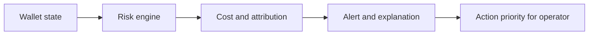

# Dexy Pitch Deck Outline

This outline is designed for a Silicon Valley-style pre-seed / seed crypto startup deck.

The deck should stay between **10 and 14 slides**. The goal is not to explain everything. The goal is to make one wedge feel inevitable.

## Slide 1: Title

### Title

Dexy

### Subtitle

The risk attribution and event alert layer for Hyperliquid operators

### Core message

Dexy helps active onchain operators see where risk is building, where profit is leaking, and why realized PnL diverges from intuition.

### Visual

- one clean product mockup
- or a simplified wallet risk summary

## Slide 2: Problem

### Title

Traders are not dying from lack of signal. They are dying from lack of visibility.

### Core message

Hyperliquid users do not primarily need more alpha. They need:

- earlier liquidation visibility
- funding / fee / fill attribution
- clarity on why results look wrong

### Visual

Three-bucket framework:

- sudden death
- slow bleed
- dying without understanding why

## Slide 3: Why Now

### Title

Hyperliquid created a dense new operator market

### Core message

- Hyperliquid concentrated serious perp users into one venue
- public observability is good enough for a non-custodial workflow wedge
- existing tooling is fragmented

### Visual

- venue map
- or “platform + fragmented third-party tools + Dexy control layer” diagram

## Slide 4: Product

### Title

Dexy is the operator control layer

### Core message

Dexy does not tell users what to buy.

Dexy tells them:

- which position is most dangerous
- where profit is leaking
- what to watch next

### Visual

- Telegram alert sample
- dashboard sample

## Slide 5: User Workflow

### Title

From wallet state to action priority

### Core message

Input:

- public wallet / account state

Output:

- risk ranking
- attribution
- event alerting
- one-line explanation

### Visual

## Slide 6: Initial ICP

### Title

Human operators first

### Core message

First customers are:

- active Hyperliquid traders
- small strategy operators
- bot runners
- builder-adjacent operators

Not:

- beginners
- public alpha buyers
- autonomous agents as first customers

### Visual

- ICP ladder or persona chart

## Slide 7: Why Users Pay

### Title

Dexy is not “nice to have” if it changes decisions

### Core message

Users pay if Dexy helps them:

- avoid a liquidation event
- catch funding/fee drag earlier
- understand why realized PnL disappointed
- save repeated manual wallet review

### Visual

- before / after workflow comparison

## Slide 8: Market and Revenue Shape

### Title

Start as operator SaaS, grow into workflow and machine rails

### Core message

Phase 1:

- human subscription

Phase 2:

- API / MCP / webhooks

Phase 3:

- x402 / machine usage
- potentially flow-linked monetization

### Visual

Three-phase revenue ladder

## Slide 9: Competitive Landscape

### Title

The market is fragmented, but nobody owns this exact wedge

### Core message

Substitutes exist:

- HyperTracker / CoinMarketMan
- Hyperdash
- Nansen
- CoinGlass
- native Hyperliquid tooling

But the opening remains:

- wallet-specific
- attribution-first
- alert-first
- operator workflow-native

### Visual

2x2:

- analytics vs workflow
- generic vs wallet-specific

## Slide 10: Why Dexy Can Win

### Title

This is not a data moat. It is a workflow moat.

### Core message

Dexy wins if it becomes:

- persistent
- personalized
- action-prioritized
- trusted for interpretation

### Visual

- moat stack diagram

## Slide 11: Roadmap

### Title

One wedge at a time

### Core message

0-3 months:

- wallet risk + attribution + Telegram alerts

3-6 months:

- replay, exports, multi-wallet, richer attribution

6-12 months:

- API / MCP / machine rails

### Visual

- simple roadmap bars

## Slide 12: Ask

### Title

What we are raising to prove

### Core message

Use of funds:

- productization
- user discovery
- workflow iteration
- data / reliability infrastructure

### Visual

- milestone-based use of funds, not generic burn chart

## Optional Appendix Slides

### Appendix 1

Case study: dangerous SP500 short wallet

### Appendix 2

Case study: profitable but funding-leaky long wallet

### Appendix 3

Pricing and comparable market evidence

### Appendix 4

Why x402 is phase 2, not phase 1
