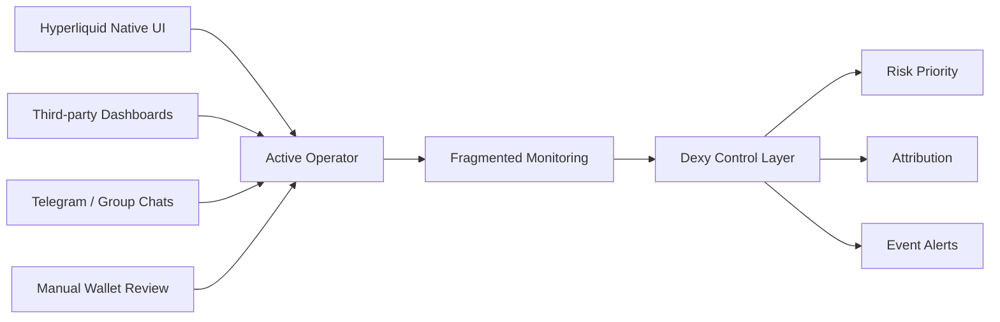
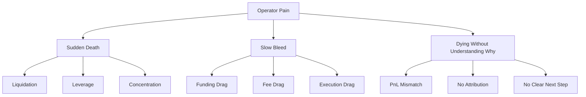
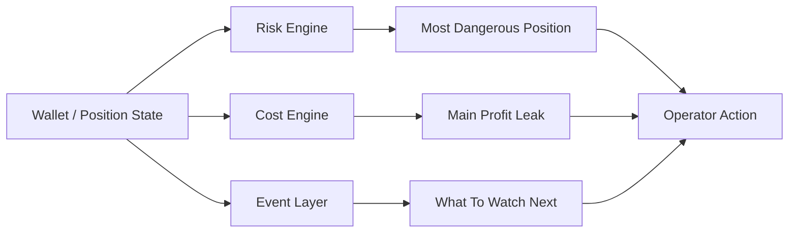
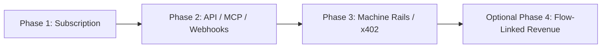
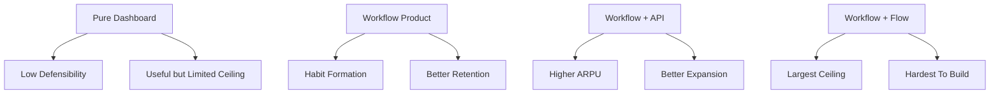
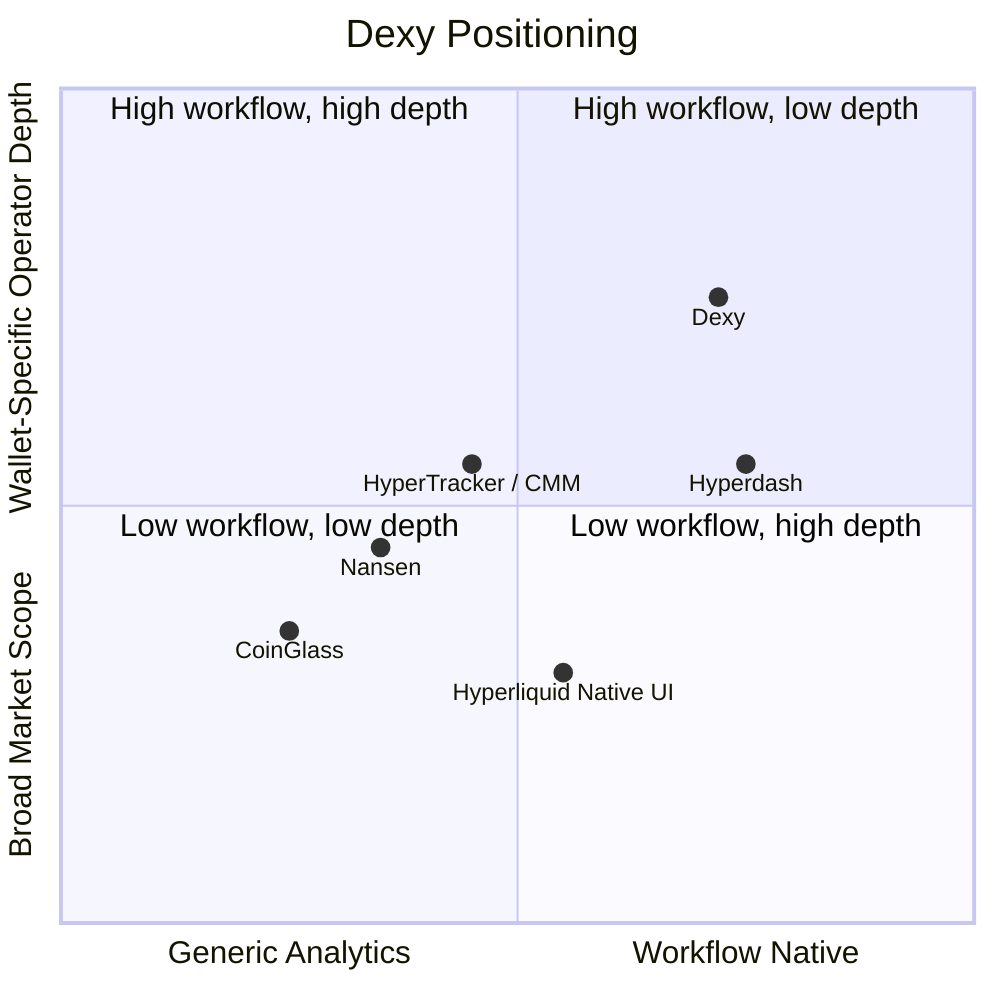
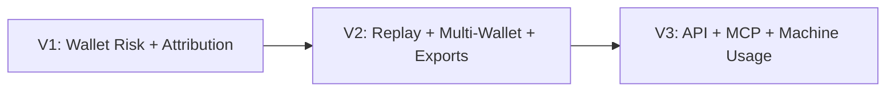
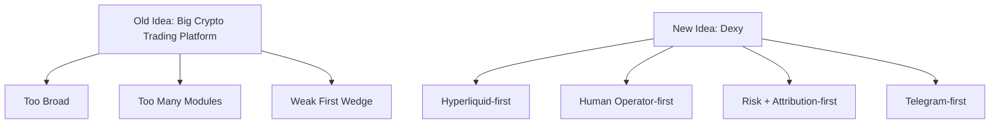
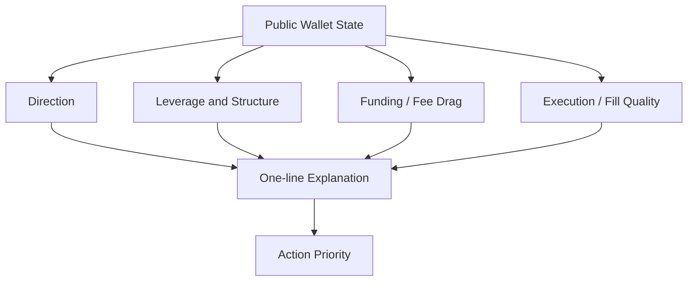

# Appendix G: Visual Exhibits

This appendix provides reusable diagrams for whitepaper, deck, and memo use.

## 1. Market Structure

### Interpretation

The operator does not lack information. The operator lacks compression, priority, and explanation.

## 2. Problem Structure

## 3. Dexy Product Logic

## 4. Business Model Ladder

### Interpretation

- phase 1 gives the business a realistic floor
- phase 2 creates workflow depth
- phase 3 creates machine-native expansion
- phase 4 is where ceiling expansion begins

## 5. Floor vs Ceiling

## 6. Competitive Positioning

## 7. Product Roadmap

## 8. Founder Narrative Compression

## 9. Case Study Structure

